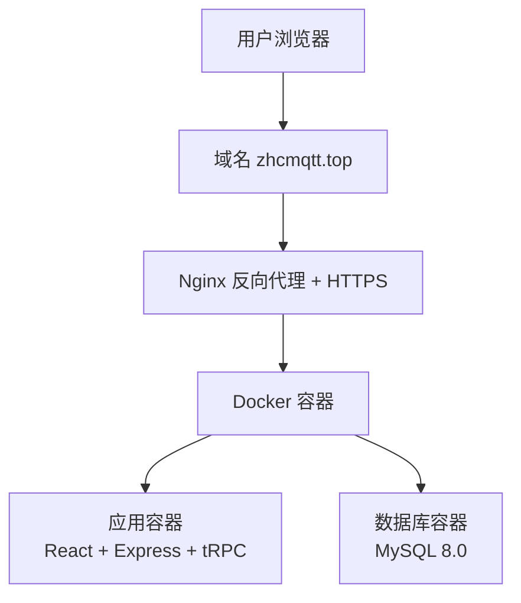

# 从零开始搭建、部署个人博客指南

[](https://github.com/zhanghongchen1213/Person_Web)
[](https://zhcmqtt.top)
[](LICENSE)
[](https://www.docker.com/)

## 📖 前言

### 项目简介

Person_Web 是一个基于 **React 19 + Express + tRPC + MySQL** 的现代化全栈个人博客系统。本项目采用 Docker 容器化部署，提供完整的一键部署脚本，让你可以快速在云服务器上搭建属于自己的技术博客。

### 📝 项目信息

> **📝 开源地址**：[Person_Web](https://github.com/zhanghongchen1213/Person_Web)
> **🎯 在线演示**：[zhcmqtt.top](https://zhcmqtt.top)
> **📅 最后更新**：2026-01-20
> **🚀 部署目标**：将个人博客部署到云服务器（华为云、阿里云、腾讯云等）
> **⏱️ 预计耗时**：首次部署约 30-60 分钟（含服务器配置）

### 📸 项目截图

<div align="center">

**个人页面**

[](https://imgloc.com/image/yzv3Eh)

**首页展示**

[](https://imgloc.com/image/yzvi0e)

**文章详情页**

[](https://imgloc.com/image/yzF0za)

</div>

---

### 🎯 适合人群

本教程适合以下人群：

- ✅ **技术爱好者**：有基本的编程基础和 Linux 命令行使用经验
- ✅ **内容创作者**：需要一个稳定、美观的博客平台来发布技术文章

### ⭐ 项目特点

#### 🚀 技术栈先进

- **前端**：React 19 + TypeScript + Vite + TailwindCSS
- **后端**：Express + tRPC
- **数据库**：MySQL 8.0 + Drizzle ORM
- **部署**：Docker + Docker Compose + Nginx + Let's Encrypt

#### 🎨 功能完整

- ✅ Markdown 编辑器，支持代码高亮和实时预览
- ✅ 文章分类管理、标签系统
- ✅ 响应式设计，完美适配移动端
- ✅ 暗黑模式支持
- ✅ GitHub OAuth 认证，安全可靠
- ✅ 图片上传和管理
- ✅ 文档系统（支持技术文档编写）
- ✅ SEO 友好

#### 🛠️ 部署简单

- ✅ **一键部署脚本**：自动化完成所有配置
- ✅ **Docker 容器化**：环境隔离，避免依赖冲突
- ✅ **详细文档**：每一步都有清晰的说明和截图
- ✅ **国内优化**：提供镜像加速方案，解决网络问题
- ✅ **HTTPS 支持**：自动申请和续期 SSL 证书

#### 💰 成本低廉

- 云服务器：2核2G 配置约 100-300 元/年
- 域名：.top/.xyz 等域名约 10-50 元/年
- SSL 证书：Let's Encrypt 免费证书
- **总成本**：约 110-350 元/年即可拥有专业博客

### 📊 部署效果

部署完成后，你将拥有：

- 🌐 一个可通过域名访问的个人博客网站
- 🔒 HTTPS 加密连接，绿色安全锁标识
- 📝 功能完整的后台管理系统
- 📱 完美适配 PC、平板、手机的响应式界面
- ⚡ 快速的页面加载速度
- 🔐 安全的 GitHub OAuth 认证

### 部署架构简介



---

## 📋 目录

- [第一步：准备云服务器](#第一步准备云服务器)
- [第二步：一键配置服务器环境](#第二步一键配置服务器环境)
- [第三步：配置云服务商安全组](#第三步配置云服务商安全组)
- [第四步：上传项目代码](#第四步上传项目代码)
- [第五步：配置个人信息（重要）](#第五步配置个人信息重要)
- [第六步：配置环境变量](#第六步配置环境变量)
- [第七步：一键部署应用](#第七步一键部署应用)
- [第八步：访问你的博客](#第八步访问你的博客)
- [第九步：配置域名和 HTTPS（可选）](#第九步配置域名和-https可选)
- [常见问题解答](#常见问题解答)
- [日常维护指南](#日常维护指南)

---

## 一、准备云服务器

### 1.1 购买云服务器

你可以选择以下任一云服务商：

- **华为云**：https://www.huaweicloud.com/
- **阿里云**：https://www.aliyun.com/
- **腾讯云**：https://cloud.tencent.com/

**推荐配置**：

| 配置项   | 最低要求         | 说明                   |
| -------- | ---------------- | ---------------------- |
| CPU      | 2 核心           | 保证应用流畅运行       |
| 内存     | 2GB              | 足够运行 Docker 容器   |
| 磁盘     | 20GB             | 存储系统、应用和数据库 |
| 操作系统 | Ubuntu 22.04 LTS | 推荐使用 Ubuntu        |
| 带宽     | 1Mbps            | 个人博客足够使用       |

💡 **小贴士**：新用户通常有优惠活动，2核2G配置一年大约 100-300 元。

---

### 1.2 购买域名（可选但推荐）

如果你想使用自己的域名（如 `myblog.com`），需要：

1. 在域名注册商购买域名（如阿里云、腾讯云、GoDaddy）
2. 将域名解析到你的服务器 IP 地址

**域名解析步骤**：

```
1. 登录域名管理控制台
2. 找到 DNS 解析设置
3. 添加 A 记录：
   - 主机记录：@ (代表根域名)
   - 记录类型：A
   - 记录值：你的服务器公网 IP
4. 添加 A 记录：
   - 主机记录：www
   - 记录类型：A
   - 记录值：你的服务器公网 IP
```

💡 **小贴士**：如果暂时没有域名，可以先使用服务器 IP 地址访问，后续再配置域名。

---

### 1.3 连接到服务器

使用 SSH 连接到你的服务器：

**Windows 用户**：

```bash
# 使用 PowerShell 或 Windows Terminal
ssh root@你的服务器IP
# 例如：ssh root@123.45.67.89
```

**Mac/Linux 用户**：

```bash
# 使用终端
ssh root@你的服务器IP
```

首次连接会提示是否信任服务器，输入 `yes` 并回车，然后输入服务器密码。

✅ **成功标志**：看到类似 `root@hostname:~#` 的命令提示符。

---

## 二、一键配置服务器环境

项目提供了一键配置脚本，可以自动完成 Docker、Nginx 和防火墙的安装配置。

### 2.1 创建项目目录

```bash
# 创建项目目录
sudo mkdir -p /opt/Person_Web

# 设置目录所有者为当前用户
sudo chown -R $USER:$USER /opt/Person_Web

# 进入项目目录
cd /opt/Person_Web
```

### 2.2 上传项目到服务器

#### 方法一：使用 GitHub 镜像加速（推荐，适用于国内服务器）

如果你的云服务器无法直接访问 GitHub，可以使用以下镜像加速服务：

```bash
# 安装 Git（如果未安装）
sudo apt install -y git

# 方案 1：使用 ghproxy.com 镜像（推荐）
git clone https://ghproxy.com/https://github.com/zhanghongchen1213/Person_Web /opt/Person_Web

# 方案 2：使用 gitclone.com 镜像
git clone https://gitclone.com/github.com/zhanghongchen1213/Person_Web /opt/Person_Web

# 方案 3：使用 fastgit 镜像
git clone https://hub.fastgit.xyz/zhanghongchen1213/Person_Web /opt/Person_Web

# 进入项目目录
cd /opt/Person_Web
```

💡 **小贴士**：

- 镜像服务可能会有延迟，建议优先尝试 ghproxy.com
- 如果一个镜像失败，可以尝试其他镜像
- 镜像服务仅用于克隆，后续 git 操作会自动使用原始仓库地址

#### 方法二：手动上传代码（备选方案）

如果 Git 克隆始终失败，可以手动上传代码：

1. **在本地下载项目**：
   - 访问 https://github.com/zhanghongchen1213/Person_Web
   - 点击 "Code" → "Download ZIP"
   - 解压到本地

2. **上传到服务器**并解压

   ```bash
   unzip Person_Web-main.zip
   rm -rf Person_Web-main.zip
   cd Person_Web-main
   ```

### 2.3 配置网络环境（重要，适用于国内服务器）

⚠️ **重要提示**：如果你的云服务器在国内，或者无法正常访问 GitHub、Docker Hub 等国外资源，**必须先执行此步骤**配置镜像源，否则后续安装可能会失败或非常缓慢。

项目提供了网络环境配置脚本，可以自动配置国内镜像源，解决网络访问问题。

```bash
# 进入项目目录
cd /opt/Person_Web

# 赋予脚本执行权限
chmod +x deploy/scripts/*

# 执行网络环境配置脚本
sudo bash deploy/scripts/setup-network.sh
```

脚本会自动完成以下配置：

1. ✅ **APT 软件源** - 切换到阿里云镜像，加速软件包下载
2. ✅ **Docker 镜像源** - 配置国内镜像加速器（腾讯云、DaoCloud、DockerProxy）
3. ✅ **Git 配置优化** - 禁用 HTTP/2，增加缓冲区，解决克隆失败问题
4. ✅ **npm 镜像源** - 配置淘宝镜像（如已安装 npm）

✅ **预期输出**：

[](https://imgloc.com/image/yV63jQ)

💡 **配置效果**：

- ✅ APT 软件包下载速度提升 10-50 倍
- ✅ Docker 镜像拉取速度提升 10-100 倍
- ✅ Git 克隆成功率接近 100%
- ✅ npm 包安装速度提升 5-20 倍

### 2.4 执行服务器环境配置脚本

```bash
# 执行服务器环境配置脚本
sudo bash deploy/scripts/setup-server.sh
```

脚本会自动完成以下操作：

1. ✅ **更新系统软件包** - 更新 apt 软件包列表
2. ✅ **安装 Docker** - 使用官方脚本安装 Docker 和 Docker Compose
3. ✅ **配置 Docker 权限** - 将当前用户添加到 docker 组
4. ✅ **安装 Nginx** - 安装并启动 Nginx 服务
5. ✅ **配置防火墙** - 开放必要端口（22, 80, 443）
6. ✅ **验证安装** - 测试所有服务是否正常运行

### 2.5 预期输出

[](https://imgloc.com/image/yV8yHp)

---

## 三、配置云服务商安全组

除了服务器防火墙，还需要在云服务商控制台配置安全组：

1. 登录云服务商控制台
2. 找到你的服务器实例
3. 进入"安全组"或"防火墙"设置
4. 添加入站规则：
   - 端口 22（SSH）
   - 端口 80（HTTP）
   - 端口 443（HTTPS）

💡 **小贴士**：不同云服务商的界面略有不同，但操作逻辑相同。

---

## 四、配置个人信息（重要）

⚠️ **重要提示**：在部署之前，你需要将项目中的示例个人信息替换为你自己的信息。

### 4.1 使用一键配置脚本（推荐）

项目提供了交互式个人信息配置脚本，可以自动替换所有相关文件中的个人信息。

```bash
cd Person_Web-main
bash deploy/scripts/setup-personal-info.sh
```

脚本会提示你输入以下信息：

1. **GitHub 用户名**：你的 GitHub 用户名（用于头像和个人主页链接）
2. **域名**：你的博客域名（如 `myblog.com`）
3. **邮箱地址**：你的联系邮箱
4. **微信号**：你的微信号（可选）

### 4.2 手动替换（备选方案）

如果你不想使用脚本，也可以手动替换以下文件中的个人信息：

**需要替换的文件：**

- `client/src/pages/About.tsx` - 关于页面
- `client/src/components/Footer.tsx` - 页脚组件
- `README.md` - 项目文档

**需要替换的信息：**

- `zhanghongchen1213` → 你的 GitHub 用户名
- `zhcmqtt.top` → 你的域名
- `admin@zhcmqtt.top` → 你的邮箱
- `zhang_hongchen` → 你的微信号

💡 **小贴士**：使用脚本替换更安全，可以避免遗漏。

---

## 五、配置环境变量

环境变量包含了应用运行所需的配置信息，如数据库密码、JWT 密钥等。

### 5.1 使用一键配置脚本（推荐）

项目提供了交互式环境变量配置脚本，可以自动生成强密码并创建配置文件。

⚠️ **重要提示**：为了确保博客安全，**强烈推荐使用 GitHub OAuth 认证**，这样只有你的 GitHub 账号能够登录管理员后台。

#### 步骤 1：创建 GitHub OAuth 应用（推荐）

在运行配置脚本之前，建议先创建 GitHub OAuth 应用以获取必要的认证参数。

1. 访问 [GitHub Developer Settings](https://github.com/settings/developers)
2. 点击 **"New OAuth App"** 创建新应用
3. 填写应用信息：
   - **Application name**: 你的博客名称（如 "My Personal Blog"）
   - **Homepage URL**: `https://你的域名`
   - **Authorization callback URL**: `https://你的域名/api/auth/github/callback`
4. 点击 **"Register application"**
5. 记录下 **Client ID** 和 **Client Secret**（稍后配置时需要）
6. 获取你的 GitHub 用户 ID：
   - 访问 `https://api.github.com/users/你的GitHub用户名`
   - 记录返回的 JSON 中的 `id` 字段值

💡 **示例**：如果你的 GitHub 用户名是 `zhangsan`，访问 `https://api.github.com/users/zhangsan`，会看到类似：

```json
{
  "id": 12345678,
  "login": "zhangsan",
  ...
}
```

记录下 `id: 12345678`，稍后配置时需要填写 `github:12345678`。

#### 步骤 2：运行配置脚本

```bash
# 执行环境变量配置脚本
sudo bash deploy/scripts/setup-env.sh
```

脚本会交互式地询问你以下配置：

1. **MySQL root 密码**（留空自动生成32位强密码）
2. **JWT 密钥**（留空自动生成32位强密码）
3. **GitHub OAuth 配置**（必须配置，输入上一步获取的参数）：
   - GitHub Client ID
   - GitHub Client Secret
   - GitHub Callback URL
4. **管理员 GitHub 用户 ID**（格式为 `github:你的GitHub用户ID`）

配置完成后，脚本会自动生成 `.env.production` 文件。

✅ **预期输出**（配置 GitHub OAuth）：

[](https://imgloc.com/image/yV8aLO)

🔒 **安全优势**：

- ✅ 只有你的 GitHub 账号能够登录管理员后台
- ✅ 使用 GitHub 官方 OAuth 认证，安全可靠
- ✅ 无需记忆复杂的登录链接
- ✅ 支持后续添加其他 GitHub 用户为管理员

---

## 六、一键部署应用

项目提供了一键部署脚本，会自动完成所有部署步骤。

### 6.1 执行一键部署

```bash
# 执行一键部署脚本
sudo bash deploy/scripts/deploy.sh
```

⏱️ **预计耗时**：10-20 分钟（首次部署需要下载 Docker 镜像，会比较慢，请耐心等待）

[](https://imgloc.com/image/ybCXcY)

---

### 5.2 部署过程说明

部署脚本会自动执行以下 8 个步骤：

1. ✅ **检查 Docker 环境** - 确保 Docker 和 Docker Compose 已安装
2. ✅ **检查配置文件** - 验证 `.env.production` 文件存在且配置正确
3. ✅ **停止旧容器** - 如果有旧版本运行，先停止并删除
4. ✅ **构建新镜像** - 构建包含最新代码的 Docker 镜像
5. ✅ **启动新容器** - 启动应用容器和数据库容器
6. ✅ **执行数据库迁移** - 创建数据库表结构
7. ✅ **健康检查** - 等待应用启动并验证运行状态
8. ✅ **输出部署结果** - 显示部署成功信息和常用命令

### 5.3 预期输出

[](https://imgloc.com/image/yb11kx)

### 5.4 验证部署

#### 检查容器状态

```bash
# 查看所有容器状态
docker compose ps
```

✅ **预期输出**：

```
NAME                IMAGE               STATUS              PORTS
person_web_app      person-web:latest   Up 2 minutes (healthy)   0.0.0.0:3000->3000/tcp
person_web_mysql    mysql:8.0           Up 2 minutes (healthy)   0.0.0.0:3306->3306/tcp
```

两个容器的状态都应该是 `Up` 且显示 `(healthy)`。

#### 查看应用日志

```bash
# 查看应用日志（实时）
docker compose logs -f app
```

✅ **预期输出**：应该能看到类似以下的日志：

```
[INFO] Server running on http://localhost:3000
[INFO] Database connected successfully
```

按 `Ctrl + C` 退出日志查看。

#### 测试应用访问

```bash
# 测试本地访问
curl http://localhost:3000
```

✅ **预期输出**：返回 HTML 内容（博客首页）

---

## 七、配置域名和 HTTPS

⚠️ **本步骤为可选项**：如果你没有域名或暂时不需要 HTTPS，可以跳过此步骤。使用 IP 地址访问博客已经完全可以正常使用。

如果你有自己的域名，强烈建议配置 HTTPS 证书，让你的博客更安全、更专业。

### 6.1 前置准备

在开始配置之前，请确保：

1. ✅ 你已经购买了域名（如 `myblog.com`）
2. ✅ 域名已经解析到你的服务器 IP 地址
3. ✅ 博客已经可以通过 IP 地址正常访问

### 6.2 配置域名（一键脚本）

项目提供了域名配置脚本，可以自动替换所有配置文件中的域名。

```bash
# 执行域名配置脚本
sudo bash deploy/scripts/setup-domain.sh 你的域名
# 例如：bash deploy/scripts/setup-domain.sh zhcmqtt.top
```

⏱️ **预计耗时**：10 秒

脚本会自动完成以下操作：

1. ✅ 备份原始配置文件
2. ✅ 替换 SSL 证书申请脚本中的域名
3. ✅ 创建新的 Nginx 配置文件（使用你的域名）
4. ✅ 输出后续操作步骤

### 6.3 准备 Let's Encrypt 验证目录

在部署 Nginx 配置前，需要先创建 SSL 证书验证目录：

```bash
# 创建 Let's Encrypt 验证目录
sudo mkdir -p /var/www/html/.well-known/acme-challenge

# 设置正确的权限
sudo chmod -R 755 /var/www/html/.well-known
```

### 6.4 部署 HTTP Nginx 配置（用于证书申请）

⚠️ **重要**：首次配置时，需要先部署 HTTP 配置，申请证书成功后再切换到 HTTPS 配置。

```bash
# 删除旧配置（如果存在）
sudo rm -f /etc/nginx/sites-enabled/default
sudo rm -f /etc/nginx/sites-enabled/你的域名.conf
# 例如：sudo rm -f /etc/nginx/sites-enabled/zhcmqtt.top.conf

# 复制 HTTP 配置文件到系统目录
sudo cp deploy/nginx/你的域名.conf /etc/nginx/sites-available/
# 例如：sudo cp deploy/nginx/zhcmqtt.top.conf /etc/nginx/sites-available/

# 创建软链接启用配置
sudo ln -s /etc/nginx/sites-available/你的域名.conf /etc/nginx/sites-enabled/
# 例如：sudo ln -s /etc/nginx/sites-available/zhcmqtt.top.conf /etc/nginx/sites-enabled/

# 测试 Nginx 配置
sudo nginx -t

# 重启 Nginx
sudo systemctl restart nginx
```

✅ **预期输出**：`syntax is ok` 和 `test is successful`

**验证 HTTP 访问**：

```bash
# 测试域名访问
curl -I http://你的域名
# 例如：curl -I http://zhcmqtt.top

# 应该返回 HTTP/1.1 200 或看到 HTML 内容
```

### 6.5 申请 SSL 证书（一键脚本）

⚠️ **前提条件**：确保 HTTP 访问正常后再执行此步骤。

项目提供了 SSL 证书申请脚本，可以自动完成所有步骤。

```bash
# 执行 SSL 证书申请脚本
sudo bash deploy/scripts/setup-ssl.sh 你的域名 你的邮箱

# 例如：sudo bash deploy/scripts/setup-ssl.sh zhcmqtt.top admin@zhcmqtt.top
```

⏱️ **预计耗时**：2-3 分钟

脚本会自动完成以下操作：

1. ✅ 检查并安装 Certbot
2. ✅ 申请 Let's Encrypt SSL 证书
3. ✅ 配置证书自动续期
4. ✅ 测试证书续期功能

✅ **成功标志**：看到 `Congratulations! Your certificate and chain have been saved` 消息

---

[](https://imgloc.com/image/ybi7ft)

---

### 6.6 部署 HTTPS Nginx 配置

证书申请成功后，需要切换到 HTTPS 配置：

```bash
# 删除 HTTP 配置
sudo rm -f /etc/nginx/sites-enabled/你的域名.conf
# 例如：sudo rm -f /etc/nginx/sites-enabled/zhcmqtt.top.conf

# 复制 HTTPS 配置文件
sudo cp deploy/nginx/你的域名-https.conf /etc/nginx/sites-available/
# 例如：sudo cp deploy/nginx/zhcmqtt.top-https.conf /etc/nginx/sites-available/

# 启用 HTTPS 配置
sudo ln -s /etc/nginx/sites-available/你的域名-https.conf /etc/nginx/sites-enabled/
# 例如：sudo ln -s /etc/nginx/sites-available/zhcmqtt.top-https.conf /etc/nginx/sites-enabled/

# 测试配置
sudo nginx -t

# 重启 Nginx
sudo systemctl restart nginx
```

### 6.7 验证 HTTPS 访问

```bash
# 测试 HTTPS 访问
curl -I https://你的域名
# 例如：curl -I https://zhcmqtt.top
```

✅ **预期输出**：`HTTP/2 200`

或者在浏览器中访问 `https://你的域名`，应该能看到：

- ✅ 绿色锁图标
- ✅ 地址栏显示"安全"或"连接是安全的"
- ✅ HTTP 自动重定向到 HTTPS

### 6.8 证书自动续期说明

SSL 证书申请脚本已经自动配置了证书续期任务。Let's Encrypt 证书有效期为 90 天，系统会在到期前自动续期。

你可以手动测试续期功能：

```bash
# 测试证书续期（不会真正续期）
sudo certbot renew --dry-run
```

✅ **预期输出**：`Congratulations, all simulated renewals succeeded`

💡 **小贴士**：

- 证书会在到期前 30 天自动续期
- 续期失败会发送邮件通知到你配置的邮箱
- 可以使用 `sudo certbot certificates` 查看证书状态

---

## 八、访问你的博客

恭喜！你的博客已经部署成功了。现在让我们了解如何访问博客。

💡 **提示**：如果你还没有域名，可以直接使用服务器 IP 地址访问。域名配置是可选的，可以在第七步中完成。

### 7.1 使用 域名 访问

#### 访客访问

访客可以通过以下方式访问你的博客：

```
https://你的域名
```

例如：`https://zhcmqtt.top`

💡 **访客可以做什么**：

- ✅ 浏览所有已发布的博客文章
- ✅ 查看文章分类
- ✅ 搜索文章
- ✅ 查看文档（如果有）
- ❌ 无法创建、编辑或删除文章

#### 管理员访问

作为博客的管理员，你需要使用 **GitHub OAuth 登录**进行身份验证。

⚠️ **重要提示**：在第四步"配置环境变量"时，如果你已经按照推荐方式配置了 GitHub OAuth，可以直接登录。如果还没有配置，请先返回第四步完成 GitHub OAuth 配置。

💡 **管理员可以做什么**：

- ✅ 创建新文章（博客或文档）https://你的域名/write
- ✅ 编辑已有文章 https://你的域名/admin/articles
- ✅ 删除文章
- ✅ 管理分类
- ✅ 修改文章发布状态（草稿/已发布/归档）
- ✅ 上传图片

✅ **成功标志**：

- 访客模式：可以浏览文章，但无法编辑
- 管理员模式：右上角有"写文章"按钮，可以创建和编辑文章,删除文章,管理分类,修改文章发布状态,上传图片

---

## 常见问题解答

### Q1: 如何备份数据？

**备份数据库**：

```bash
# 创建备份目录
mkdir -p /opt/backups

# 备份数据库
docker exec person_web_mysql mysqldump -uroot -p你的数据库密码 personal_blog > /opt/backups/blog-$(date +%Y%m%d).sql

# 压缩备份文件
gzip /opt/backups/blog-$(date +%Y%m%d).sql
```

**备份上传的文件**：

```bash
# 备份 uploads 目录
tar -czf /opt/backups/uploads-$(date +%Y%m%d).tar.gz -C /opt/Person_Web uploads/
```

### Q2: 如何恢复数据？

**恢复数据库**：

```bash
# 解压备份文件
gunzip /opt/backups/blog-20260119.sql.gz

# 恢复数据库
docker exec -i person_web_mysql mysql -uroot -p你的数据库密码 personal_blog < /opt/backups/blog-20260119.sql
```

---

## 日常维护指南

### 常用命令速查表

| 操作            | 命令                                               |
| --------------- | -------------------------------------------------- |
| 查看容器状态    | `docker compose ps`                                |
| 启动所有服务    | `docker compose up -d`                             |
| 停止所有服务    | `docker compose down`                              |
| 重启应用        | `docker compose restart app`                       |
| 重启数据库      | `docker compose restart mysql`                     |
| 查看应用日志    | `docker compose logs -f app`                       |
| 查看数据库日志  | `docker compose logs -f mysql`                     |
| 进入应用容器    | `docker exec -it person_web_app sh`                |
| 进入数据库容器  | `docker exec -it person_web_mysql mysql -uroot -p` |
| 重新部署        | `bash deploy/scripts/deploy.sh`                    |
| 重载 Nginx      | `sudo systemctl reload nginx`                      |
| 测试 Nginx 配置 | `sudo nginx -t`                                    |

### 定期维护任务

#### 每周任务

1. **检查容器状态**

   ```bash
   docker compose ps
   docker stats --no-stream
   ```

2. **查看磁盘使用情况**

   ```bash
   df -h
   du -sh /opt/Person_Web/uploads
   ```

3. **备份数据库**

   ```bash
   mkdir -p /opt/backups
   docker exec person_web_mysql mysqldump -uroot -p你的数据库密码 personal_blog | gzip > /opt/backups/blog-$(date +%Y%m%d).sql.gz
   ```

#### 每月任务

1. **更新系统软件包**

   ```bash
   sudo apt update
   sudo apt upgrade -y
   ```

2. **清理 Docker 资源**

   ```bash
   # 清理未使用的镜像、容器、网络
   docker system prune -a
   ```

3. **检查 SSL 证书有效期**

   ```bash
   sudo certbot certificates
   ```

#### 每季度任务

1. **完整备份**

   ```bash
   # 备份数据库
   docker exec person_web_mysql mysqldump -uroot -p你的数据库密码 personal_blog | gzip > /opt/backups/full-backup-$(date +%Y%m%d)-db.sql.gz

   # 备份上传文件
   tar -czf /opt/backups/full-backup-$(date +%Y%m%d)-uploads.tar.gz -C /opt/Person_Web uploads/

   # 备份配置文件
   cp /opt/Person_Web/.env.production /opt/backups/env-backup-$(date +%Y%m%d)
   ```

2. **性能优化检查**

   ```bash
   # 查看容器资源使用
   docker stats

   # 查看数据库大小
   docker exec person_web_mysql mysql -uroot -p你的数据库密码 -e "SELECT table_schema AS 'Database', ROUND(SUM(data_length + index_length) / 1024 / 1024, 2) AS 'Size (MB)' FROM information_schema.tables GROUP BY table_schema;"
   ```

### 故障排查流程

当博客出现问题时，按照以下流程排查：

1. **检查容器状态**

   ```bash
   docker compose ps
   ```

2. **查看应用日志**

   ```bash
   docker compose logs --tail=50 app
   ```

3. **查看数据库日志**

   ```bash
   docker compose logs --tail=50 mysql
   ```

4. **检查系统资源**

   ```bash
   free -h  # 内存使用
   df -h    # 磁盘使用
   ```

5. **重启服务**

   ```bash
   docker compose restart
   ```

6. **如果问题依然存在，查看详细日志**

   ```bash
   docker compose logs app > /tmp/app-logs.txt
   docker compose logs mysql > /tmp/mysql-logs.txt
   ```

---

## 附录

### 项目文件结构

```
Person_Web/
├── client/                 # 前端代码
│   ├── src/
│   │   ├── pages/         # 页面组件
│   │   ├── components/    # UI 组件
│   │   └── lib/           # 工具函数
│   └── index.html
├── server/                # 后端代码
│   ├── _core/            # 核心功能
│   ├── routers.ts        # tRPC 路由
│   ├── db.ts             # 数据库操作
│   └── index.ts          # 服务器入口
├── drizzle/              # 数据库相关
│   ├── schema.ts         # 表结构定义
│   └── migrations/       # 迁移文件
├── deploy/               # 部署相关
│   ├── nginx/           # Nginx 配置
│   └── scripts/         # 部署脚本
├── uploads/              # 上传文件目录
├── .env.production       # 生产环境变量
├── docker-compose.yml    # Docker Compose 配置
├── Dockerfile            # Docker 镜像构建
└── package.json          # 项目依赖
```

### 技术栈说明

- **前端**: React 19 + TypeScript + Vite
- **后端**: Express + tRPC + TypeScript
- **数据库**: MySQL 8.0
- **ORM**: Drizzle ORM
- **容器化**: Docker + Docker Compose
- **Web 服务器**: Nginx
- **SSL 证书**: Let's Encrypt (Certbot)

### 获取帮助

如果遇到本文档未涵盖的问题：

1. **查看日志**
   - 应用日志：`docker compose logs app`
   - 数据库日志：`docker compose logs mysql`
   - Nginx 日志：`/var/log/nginx/error.log`

2. **在线资源**
   - Docker 官方文档：https://docs.docker.com/
   - Nginx 官方文档：https://nginx.org/en/docs/
   - MySQL 官方文档：https://dev.mysql.com/doc/
